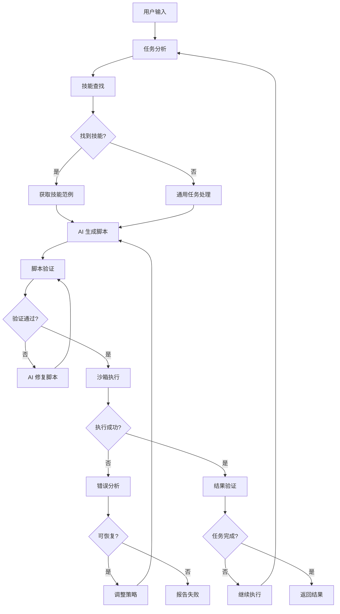

# ADR-003: Agent 循环设计

## 状态

接受

## 上下文

Agentic Playwright MCP 需要一个 Agent 循环来协调 AI 和浏览器自动化。主要考虑：

1. **任务理解**：如何将用户意图转化为可执行的步骤
2. **技能匹配**：如何从技能库中找到合适的技能
3. **脚本生成**：如何让 AI 生成正确的脚本
4. **错误恢复**：执行失败时如何处理
5. **结果验证**：如何确认任务完成

### 传统方案的问题

**逐步调用方案**：

```
用户: 帮我在百度搜索 Python 教程
AI: 我需要先打开百度 (调用 goto)
AI: 现在输入关键词 (调用 fill)
AI: 点击搜索按钮 (调用 click)
AI: 等待结果 (调用 wait)
AI: 截图确认 (调用 screenshot)
```

问题：
- 每步都需要 AI 决策，延迟高
- 上下文窗口消耗大
- 容易丢失状态
- 无法利用技能库的范例

### 需求

1. **高效**：减少 AI 调用次数
2. **可靠**：自动处理常见错误
3. **可扩展**：容易添加新技能
4. **可观察**：执行过程透明

## 决策

采用**脚本驱动的 Agent 循环**，结合技能库和沙箱执行。

### 核心设计



### 状态机设计

```python
class AgentState(Enum):
    INIT = "init"
    ANALYZING = "analyzing"
    SEARCHING_SKILLS = "searching_skills"
    GENERATING_SCRIPT = "generating_script"
    VALIDATING_SCRIPT = "validating_script"
    EXECUTING = "executing"
    VERIFYING = "verifying"
    RECOVERING = "recovering"
    COMPLETED = "completed"
    FAILED = "failed"
```

### 核心循环

```python
class AgentLoop:
    def __init__(self, llm, skill_registry, script_engine):
        self.llm = llm
        self.skill_registry = skill_registry
        self.script_engine = script_engine
        self.state = AgentState.INIT
        self.max_steps = 10
        self.max_retries = 3

    async def run(self, task: str) -> AgentResult:
        """执行任务的主循环"""
        self.state = AgentState.ANALYZING

        for step in range(self.max_steps):
            # 1. 分析任务
            analysis = await self._analyze_task(task)

            # 2. 查找技能
            self.state = AgentState.SEARCHING_SKILLS
            skills = await self._find_skills(analysis)

            # 3. 生成脚本
            self.state = AgentState.GENERATING_SCRIPT
            script = await self._generate_script(task, skills)

            # 4. 验证脚本
            self.state = AgentState.VALIDATING_SCRIPT
            if not await self._validate_script(script):
                script = await self._fix_script(script)
                continue

            # 5. 执行脚本
            self.state = AgentState.EXECUTING
            result = await self._execute_script(script)

            # 6. 验证结果
            self.state = AgentState.VERIFYING
            if await self._verify_result(result, task):
                self.state = AgentState.COMPLETED
                return AgentResult(success=True, output=result)

            # 7. 错误恢复
            if not await self._can_recover(result):
                self.state = AgentState.FAILED
                return AgentResult(success=False, error=result.error)

            self.state = AgentState.RECOVERING

        self.state = AgentState.FAILED
        return AgentResult(success=False, error="超过最大步数")
```

### 阶段详解

#### 1. 任务分析（规则优先 + LLM 兜底）

任务理解采用**混合策略**，优先用硬编码规则（零延迟、零成本），失败时降级到 LLM：

```python
async def _analyze_task(self, task: str) -> TaskAnalysis:
    """分析用户任务，提取关键信息"""

    # 第一步：硬编码规则（关键词匹配 + 正则）
    intent = script_generator.parse_intent(task)
    if intent:
        return TaskAnalysis.from_intent(intent)

    # 第二步：技能库触发词匹配
    skills = skill_registry.search(query=task)
    if skills:
        best = select_best_skill(skills, task)
        return TaskAnalysis.from_skill(best, task)

    # 第三步：LLM 兜底（需要 OPENAI_API_KEY）
    if llm_parser.available:
        intent = llm_parser.parse(task)  # 返回 TaskIntent
        if intent:
            return TaskAnalysis.from_intent(intent)

    return TaskAnalysis.failed("无法理解任务")
```

LLM 返回结构化 JSON（`{action, target, engine, confidence}`），由现有模板拼装脚本。
置信度低于 0.5 时视为失败，避免错误理解导致误操作。

#### 2. 技能查找

```python
async def _find_skills(self, analysis: TaskAnalysis) -> list[Skill]:
    """从技能库中查找匹配的技能"""
    # 方式一：关键词匹配
    skills = await self.skill_registry.search(
        keywords=analysis.keywords,
        domain=analysis.domain
    )

    # 方式二：URL 模式匹配
    if analysis.url:
        url_skills = await self.skill_registry.match_url(analysis.url)
        skills.extend(url_skills)

    # 按优先级排序
    skills.sort(key=lambda s: s.priority, reverse=True)

    return skills[:5]  # 返回 Top 5
```

#### 3. 脚本生成

```python
async def _generate_script(self, task: str, skills: list[Skill]) -> str:
    """参考技能范例，生成执行脚本"""
    # 构建上下文
    context = ""
    for skill in skills:
        context += f"""
## 技能: {skill.name}
描述: {skill.description}
源码:
```python
{skill.source_code}
```
指南:
{skill.guide}
"""

    prompt = f"""
    参考以下技能范例，生成完成任务的 Python 脚本。

    ## 任务
    {task}

    ## 可用技能
    {context}

    ## 可用函数
    - goto(url): 导航到 URL
    - click(selector): 点击元素
    - fill(selector, value): 填写输入框
    - screenshot(name): 截图
    - wait(seconds): 等待
    - wait_for_navigation(timeout): 等待导航
    - wait_for_element(selector, timeout): 等待元素
    - get_url(): 获取当前 URL
    - get_title(): 获取页面标题
    - get_text(): 获取页面文本
    - smart_login(domain, username, password): 智能登录
    - smart_search(domain, query): 智能搜索
    - smart_fill_form(domain, data): 智能填写表单

    ## 要求
    1. 只生成可执行的 Python 代码
    2. 不要包含 import 语句
    3. 使用 try/except 处理可能的错误
    4. 添加必要的等待时间
    5. 使用 print() 输出进度信息
    """

    return await self.llm.generate(prompt)
```

#### 4. 脚本验证

```python
async def _validate_script(self, script: str) -> bool:
    """验证脚本语法和安全性"""
    try:
        # 语法检查
        ast.parse(script)

        # 安全检查
        self.script_engine.validate(script)

        return True
    except (SyntaxError, SecurityError) as e:
        logger.warning(f"脚本验证失败: {e}")
        return False
```

#### 5. 脚本执行

```python
async def _execute_script(self, script: str) -> ExecutionResult:
    """在沙箱中执行脚本"""
    try:
        result = await self.script_engine.execute(
            script,
            timeout=30,
            capture_output=True
        )
        return ExecutionResult(
            success=True,
            output=result.output,
            screenshots=result.screenshots
        )
    except TimeoutError:
        return ExecutionResult(
            success=False,
            error="脚本执行超时"
        )
    except Exception as e:
        return ExecutionResult(
            success=False,
            error=str(e)
        )
```

#### 6. 结果验证

```python
async def _verify_result(self, result: ExecutionResult, task: str) -> bool:
    """验证执行结果是否完成任务"""
    if not result.success:
        return False

    # 方式一：检查输出
    if "完成" in result.output or "success" in result.output.lower():
        return True

    # 方式二：视觉验证
    if result.screenshots:
        screenshot = result.screenshots[-1]
        verification = await self._verify_with_vision(screenshot, task)
        if verification:
            return True

    # 方式三：URL 验证
    current_url = await self._get_current_url()
    if self._is_expected_url(current_url, task):
        return True

    return False
```

#### 7. 错误恢复

```python
async def _can_recover(self, result: ExecutionResult) -> bool:
    """判断错误是否可恢复"""
    recoverable_errors = [
        "TimeoutError",
        "ElementNotFoundError",
        "NavigationError",
        "NetworkError",
    ]

    for error_type in recoverable_errors:
        if error_type in result.error:
            return True

    return False

async def _recover_from_error(self, result: ExecutionResult) -> None:
    """从错误中恢复"""
    # 1. 截图记录当前状态
    await self._take_screenshot("error_state")

    # 2. 分析错误原因
    error_analysis = await self._analyze_error(result.error)

    # 3. 调整策略
    if error_analysis.retryable:
        await asyncio.sleep(2)  # 等待后重试
    else:
        # 尝试备选方案
        await self._try_alternative_approach(error_analysis)
```

### 步骤回调

为了支持外部观察和控制，Agent 循环提供步骤回调：

```python
class AgentLoop:
    def __init__(self, ...):
        self.on_step_start: Optional[Callable] = None
        self.on_step_end: Optional[Callable] = None
        self.on_error: Optional[Callable] = None

    async def run(self, task: str) -> AgentResult:
        for step in range(self.max_steps):
            if self.on_step_start:
                await self.on_step_start(step, self.state)

            try:
                # ... 执行步骤 ...
                pass
            except Exception as e:
                if self.on_error:
                    await self.on_error(step, e)
                raise

            if self.on_step_end:
                await self.on_step_end(step, self.state, result)
```

## 后果

### 正面影响

1. **高效**：一次脚本生成，批量执行，减少 AI 调用
2. **可靠**：自动错误恢复，提高成功率
3. **可扩展**：技能库易于扩展
4. **可观察**：步骤回调支持外部监控

### 负面影响

1. **复杂度**：状态机和错误恢复逻辑复杂
2. **调试难度**：脚本执行失败时定位问题较难
3. **AI 依赖**：脚本质量依赖 AI 能力

### 风险缓解

1. **详细日志**：记录每个步骤的输入输出
2. **截图记录**：关键步骤截图，便于回溯
3. **超时控制**：防止无限循环
4. **最大步数**：限制执行步数，防止失控
5. **LLM 兜底**：规则无法覆盖时自动降级到 LLM 意图解析，未配置 API Key 时静默跳过

## 未来演进

### 短期

1. 支持并行执行多个子任务
2. 添加更多错误恢复策略
3. 优化脚本生成提示词

### 中期

1. 支持多轮对话，逐步完善任务
2. 添加任务分解能力
3. 支持技能组合
4. ~~规则失败时 LLM 兜底~~ ✅ 已实现（`intent_parser.py`）

### 长期

1. 自动学习新技能
2. 跨会话记忆
3. 协作执行

## 相关决策

- [ADR-001: 三层架构设计](001-three-layer-architecture.md)
- [ADR-002: 沙箱脚本引擎](002-sandboxed-script-engine.md)
