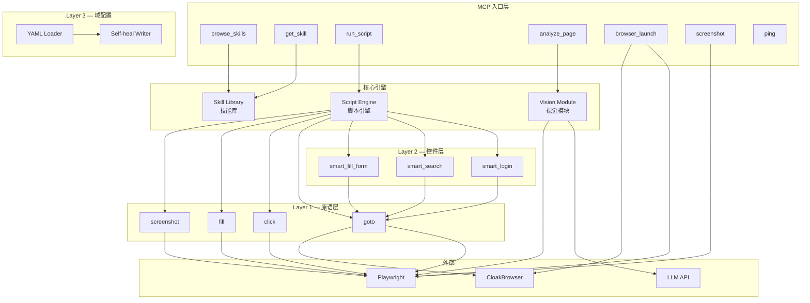
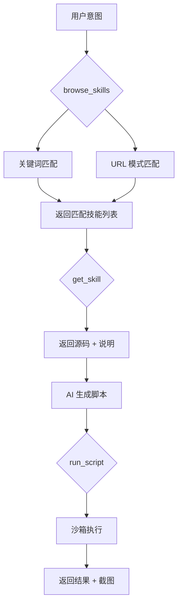
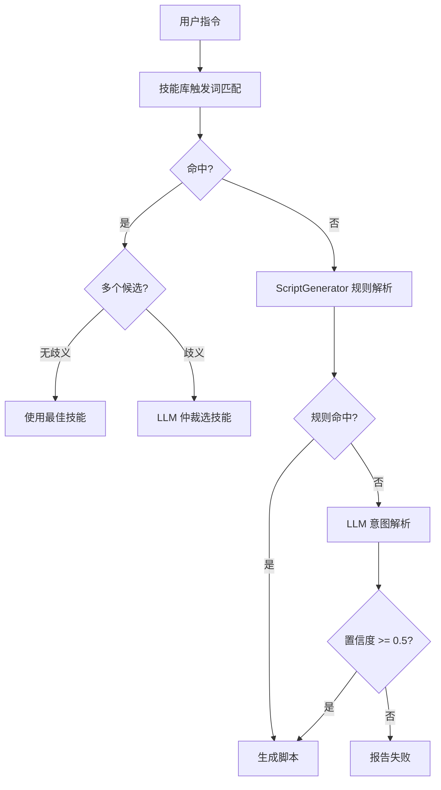
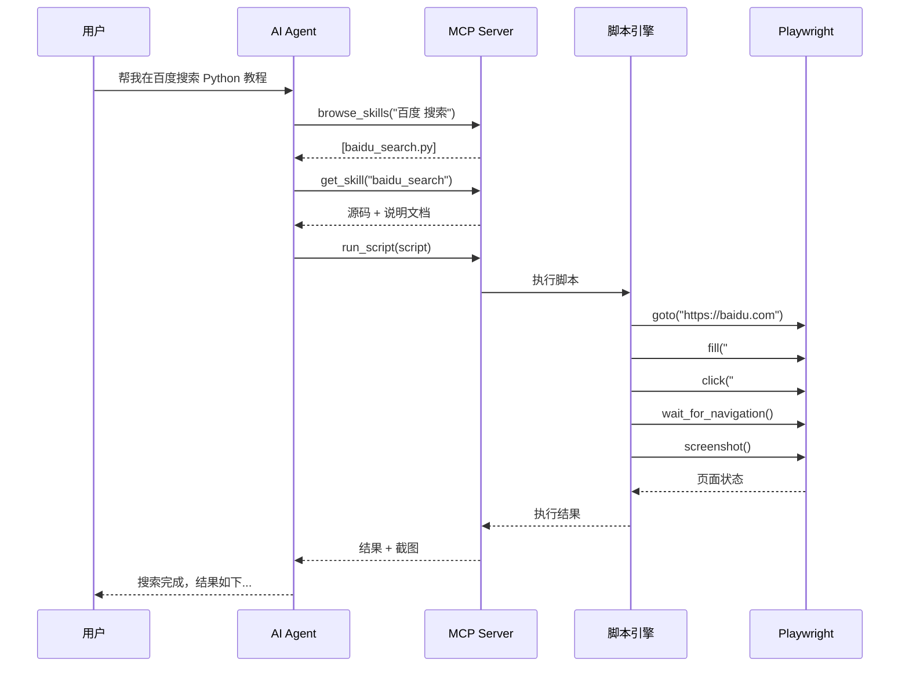

# 架构概览

本文档介绍 Agentic Playwright MCP 的系统架构设计。

## 设计理念

**核心思想：AI 不是逐个调用工具，而是编写 Python 脚本。**

传统方案中，AI Agent 需要逐步调用底层工具（点击、输入、等待），每一步都需要等待结果再决定下一步。这种方式效率低、上下文丢失多。

Agentic Playwright MCP 采用**脚本驱动**的方式：

1. AI 从技能库中查找匹配的技能范例
2. 参考范例生成完整的 Python 脚本
3. 脚本在受限沙箱中一次性执行
4. 返回执行结果和截图

## 系统架构



## 分层详解

### Layer 1 — 原语层

**职责**：提供最基础的浏览器操作原子。

```python
# src/layer_1/actions.py
async def goto(url: str) -> None
async def click(selector: str, *fallbacks: str) -> None
async def fill(selector: str, value: str) -> None
async def screenshot(name: str = "page.png") -> str
async def wait_for_navigation(timeout: int = 10) -> None
async def wait_for_element(selector: str, timeout: int = 10) -> None
```

**设计原则**：

- 所有选择器通过参数传入，不硬编码
- 支持多个备选选择器（fallback chain）
- 每个操作都有超时控制
- 失败时抛出明确的异常

### Layer 2 — 控件层

**职责**：组合原语，提供高级业务函数。

```python
# src/layer_2/controls.py
async def smart_login(domain: str, username: str, password: str, **kwargs) -> None
async def smart_search(domain: str, query: str, **kwargs) -> None
async def smart_fill_form(domain: str, data: dict, **kwargs) -> None
async def smart_click(element: str, domain: str) -> None
async def smart_fill(element: str, value: str, domain: str) -> None
```

**设计原则**：

- 通过 `domain` 参数从 Layer 3 加载选择器
- 自动处理常见的 UI 模式（登录、搜索、表单）
- 支持自定义选择器覆盖

### Layer 3 — 域配置层

**职责**：管理站点特定的选择器配置。

```yaml
# domains/baidu.yaml
name: baidu
base_url: https://www.baidu.com
locators:
  search_input:
    css:
      - "#kw"
      - "input[name='wd']"
      - ".s_ipt"
    xpath:
      - "//input[@id='kw']"
  search_button:
    css:
      - "#su"
      - "input[type='submit']"
      - ".btn-search"
```

**设计原则**：

- 每个元素提供多个备选选择器（CSS + XPath）
- 支持自愈写回：当选择器失效时，自动更新 YAML
- 使用 Pydantic 进行配置校验

### 脚本引擎

**职责**：在受限沙箱中执行 AI 生成的 Python 脚本。

```python
# 脚本引擎提供的命名空间
sandbox = {
    # Layer 1 原语
    "goto": goto,
    "click": click,
    "fill": fill,
    "screenshot": screenshot,
    # Layer 2 控件
    "smart_login": smart_login,
    "smart_search": smart_search,
    "smart_fill_form": smart_fill_form,
    # Cookie 持久化
    "save_cookies": save_cookies,
    "load_cookies": load_cookies,
    # 等待
    "wait": wait,
    "wait_for_navigation": wait_for_navigation,
    "wait_for_element": wait_for_element,
    # 页面信息
    "get_url": get_url,
    "get_title": get_title,
    "get_text": get_text,
    # 输出
    "print": print,
    "log": log,
}
```

**安全限制**：

- 禁止 `import` 语句（白名单除外）
- 禁止 `exec`, `eval`, `__import__` 等危险函数
- 禁止文件系统访问（除 screenshot 输出）
- 禁止网络访问（除浏览器操作）
- 执行超时控制（默认 30 秒）

## 技能库结构

```
src/skill_library/
├── registry.py           # 技能注册与查找
├── registry.json         # 技能索引
├── skill_base.py         # SkillBase 抽象类
├── skills.yaml           # 声明式技能配置
├── skills_schema.py      # Pydantic 校验模型
├── domains/              # 站点适配器
│   ├── baidu_search.py
│   └── github_login.py
├── interactions/         # 通用交互模板
│   ├── login_flow.py
│   ├── search_flow.py
│   ├── form_fill.py
│   └── pagination.py
└── guides/               # Markdown 说明文档
    ├── how_to_baidu_search.md
    ├── how_to_login_flow.md
    └── ...
```

### 技能匹配流程



### 意图解析：规则优先 + LLM 兜底

Agent 循环的任务理解采用**混合策略**，兼顾速度和覆盖率：



**触发条件**：

| 情况 | 处理方式 |
|------|---------|
| 规则完全匹配 | 直接用规则结果，不调 LLM |
| 多个技能评分打平（歧义） | LLM 从候选中仲裁 |
| 规则无匹配 | LLM 解析意图返回结构化 JSON |

**LLM 返回格式**：

```json
{
  "action": "search",
  "target": "python教程",
  "engine": "baidu",
  "confidence": 0.95
}
```

返回的 `TaskIntent` 走现有的 `_intent_to_script()` 模板拼装路径，LLM 只负责理解意图，不生成脚本代码。

**配置**（`.env`）：

```env
OPENAI_API_KEY=sk-your-key          # 必填，未设置时降级到纯规则
OPENAI_BASE_URL=https://api.openai.com/v1  # 可选，兼容任意 OpenAI API
OPENAI_MODEL=gpt-4o-mini            # 可选，默认 gpt-4o-mini
```

## 浏览器管理

### 双引擎支持

```python
# src/core/browser_manager.py
class BrowserManager:
    def __init__(self, use_cloak: bool = False):
        if use_cloak:
            self.engine = CloakBrowser()
        else:
            self.engine = Playwright()

    async def launch(self, headless: bool = False) -> Browser:
        ...

    async def get_page(self) -> Page:
        ...
```

### CloakBrowser 反检测

CloakBrowser 是一个反检测浏览器引擎，可以绕过常见的反爬虫检测：

| 检测服务 | Playwright | CloakBrowser |
|---------|-----------|-------------|
| reCAPTCHA v3 | 0.1 (bot) | **0.9** (human) |
| Cloudflare Turnstile | FAIL | **PASS** |
| FingerprintJS | DETECTED | **PASS** |

启用方式：

```bash
pip install -e ".[stealth]"
USE_CLOAKBROWSER=true make run
```

### Cookie 持久化

支持按站点保存和恢复浏览器登录状态，使用 Playwright 的 `storage_state` 机制。

```python
# src/core/auth_manager.py
class AuthManager:
    def list_domains(self) -> List[Dict]:      # 扫描 domains/ 并返回 auth 状态
    def has_auth(self, domain: str) -> bool:   # 检查是否有已保存的 cookie
    def load_auth(self, domain: str) -> Dict:  # 加载 storage_state
    def save_auth(self, domain, context):       # 从 BrowserContext 保存
    def delete_auth(self, domain: str) -> bool: # 删除
```

**存储结构**：

```
~/.agentic-playwright/
├── config.yaml           # 全局配置
└── auth/
    ├── baidu.json        # domains/baidu.yaml → storage_state
    ├── github.json
    └── ...
```

**自动适配**：新增 `domains/*.yaml` 站点时，cookie 管理自动支持，无需额外配置。

**集成方式**：

- `browser_manager.launch_with_domain(domain)` — 自动加载已有 cookie
- `smart_login()` — 登录成功后自动保存 cookie
- `save_cookies(domain)` / `load_cookies(domain)` — 脚本中手动调用

## 视觉模块

视觉模块使用多模态 LLM 理解页面内容：

```python
# src/core/vision.py
async def analyze_page(
    prompt: str = "描述这个页面的内容",
    model: str = "claude-3-opus"
) -> str:
    screenshot = await take_screenshot()
    response = await llm.analyze(
        image=screenshot,
        prompt=prompt
    )
    return response
```

**使用场景**：

- 验证码识别
- 动态页面理解
- 选择器失效时的视觉定位
- 页面状态验证

## 数据流

一个完整的任务执行流程：


