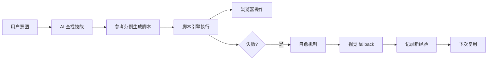
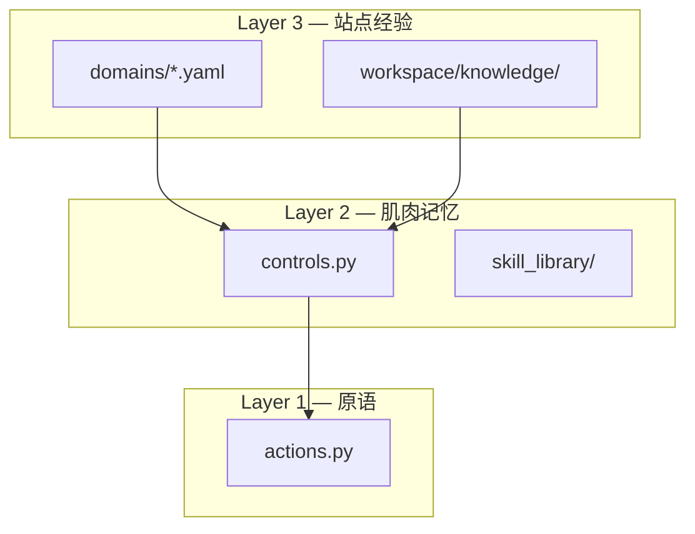

# Agentic Playwright MCP

让 AI Agent 写 Python 脚本来控制浏览器的 MCP Server 框架。

基于 Playwright，支持可选的 [CloakBrowser](https://github.com/CloakHQ/CloakBrowser) 反检测引擎。

---

## 核心理念

**AI 不是逐个调用工具，而是编写 Python 脚本。** 用得越多，系统越聪明。



## 三层进化架构



| 层级 | 职责 | 进化方式 |
|------|------|---------|
| **Layer 1** | 原子操作：goto/click/fill/screenshot | 不变 |
| **Layer 2** | 控件函数：smart_login/smart_search | 扩展新函数 |
| **Layer 3** | 站点经验：选择器 + 知识 | 自愈 + 积累 |

## 功能模块

| 模块 | 说明 | 状态 |
|------|------|------|
| **Agent 循环** | OBSERVE→PLAN→ACT 自主执行 | :material-check: |
| **脚本引擎** | 受限沙箱执行 AI 生成的 Python 脚本 | :material-check: |
| **经验进化** | 脚本复用 + 选择器经验 + 站点知识 | :material-check: |
| **控件层** | 15 个高级函数 | :material-check: |
| **技能库** | 16 个技能（12 站点 + 4 模板） | :material-check: |
| **视觉模块** | 截图 + 多模态 LLM 理解页面 | :material-check: |
| **自愈机制** | 选择器自动降级 + 优先级提升 | :material-check: |
| **Web GUI** | 浏览器可视化操作界面 | :material-check: |
| **Python SDK** | `from src.sdk import AgentLoop` | :material-check: |
| **CLI** | `browser-agent serve/run/doctor/gui` | :material-check: |

## 快速开始

```bash
git clone https://github.com/zceeeeee/agentic-playwright-mcp.git
cd agentic-playwright-mcp
pip install -e .
playwright install chromium
browser-agent gui --port 8081
```

## 使用方式

### Web GUI
```bash
browser-agent gui --port 8081
```

### CLI
```bash
browser-agent run "帮我在百度搜索 Python 教程"
```

### Python SDK
```python
from src.sdk import AgentLoop
with AgentLoop() as agent:
    result = agent.run("帮我在百度搜索 Python 教程")
```

## 统计

| 指标 | 数值 |
|------|------|
| 测试用例 | 570 个 |
| MCP 工具 | 8 个 |
| CLI 命令 | 4 个 |
| 技能库 | 16 个 |
| 域配置 | 19 个 |
