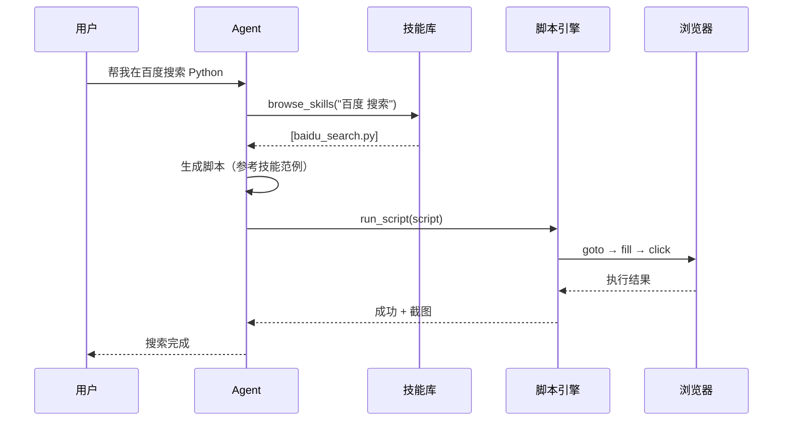
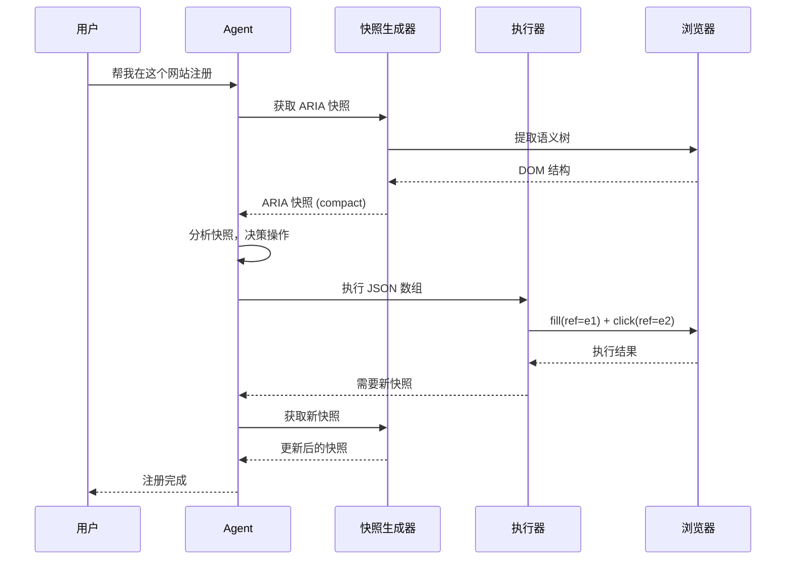

# 系统设计文档

## 1. 系统概述

**Agentic Playwright MCP** 是一个连接 LLM Agent 与浏览器的自动化框架，通过 MCP 协议暴露浏览器操作能力。

### 核心理念

| 模式             | 核心思想                     | 适用场景       |
| -------------- | ------------------------ | ---------- |
| **Script 模式**  | AI 编写 Python 脚本，一次性执行    | 已有技能库的成熟任务 |
| **Explore 模式** | AI 通过 ARIA 快照理解页面，输出原子操作 | 未知网站、首次探索  |
|                |                          |            |

---

## 2. 整体架构

```
┌─────────────────────────────────────────────────────────────────────┐
│                          MCP 入口层                                  │
│   browse_skills | get_skill | run_script | analyze_page | ...       │
└─────────────────────────────────────────────────────────────────────┘
                                │
                                ▼
┌─────────────────────────────────────────────────────────────────────┐
│                          Agent 循环                                  │
│              OBSERVE → PLAN → ACT → DONE (循环)                     │
└─────────────────────────────────────────────────────────────────────┘
                    │                           │
                    ▼                           ▼
        ┌───────────────────┐       ┌───────────────────┐
        │   Script 模式     │       │   Explore 模式    │
        │  ┌─────────────┐  │       │  ┌─────────────┐  │
        │  │ 技能库匹配   │  │       │  │ ARIA 快照   │  │
        │  │ LLM 意图解析 │  │       │  │ ref 引用    │  │
        │  │ 脚本生成     │  │       │  │ 原子操作    │  │
        │  └─────────────┘  │       │  └─────────────┘  │
        └───────────────────┘       └───────────────────┘
                    │                           │
                    ▼                           ▼
┌─────────────────────────────────────────────────────────────────────┐
│                         执行引擎层                                   │
│        ScriptEngine (Python 沙箱)  |  ExploreExecutor (JSON)        │
└─────────────────────────────────────────────────────────────────────┘
                                │
                                ▼
┌─────────────────────────────────────────────────────────────────────┐
│                         浏览器抽象层                                  │
│                   Playwright / CloakBrowser                          │
└─────────────────────────────────────────────────────────────────────┘
```

---

## 3. 分层架构

```
┌─────────────────────────────────────────────────────────────────────┐
│ Layer 3 — 域配置层 (domains/*.yaml)                                  │
│   站点特定的选择器配置、登录流程、页面结构                               │
├─────────────────────────────────────────────────────────────────────┤
│ Layer 2 — 控件层 (smart_login, smart_search, ...)                    │
│   组合原语的高级业务函数                                               │
├─────────────────────────────────────────────────────────────────────┤
│ Layer 1 — 原语层 (goto, click, fill, screenshot)                     │
│   最基础的浏览器操作原子                                               │
└─────────────────────────────────────────────────────────────────────┘
```

### 层间依赖

| 层 | 可以调用 | 不能调用 |
|----|---------|---------|
| Layer 1 | Playwright API | Layer 2, Layer 3 |
| Layer 2 | Layer 1, Layer 3 | Playwright API |
| Layer 3 | 文件系统 | Layer 1, Layer 2 |

---

## 4. 双模式执行流程

### 4.1 Script 模式（技能驱动）



**特点**：
- 一次脚本生成，批量执行
- 依赖已有技能库
- 适合成熟、可复用的任务

### 4.2 Explore 模式（快照驱动）



**特点**：
- 每步都基于当前页面状态决策
- 不依赖技能库，适合未知网站
- 自动积累经验

---

## 5. Explore 模式详解

### 5.1 核心数据流

```
┌──────────────┐     ┌──────────────┐     ┌──────────────┐
│   Page DOM   │ ──▶ │ ARIA 快照    │ ──▶ │   Agent      │
│              │     │ (YAML 格式)  │     │  (LLM 决策)  │
└──────────────┘     └──────────────┘     └──────────────┘
                                                 │
                                                 ▼
┌──────────────┐     ┌──────────────┐     ┌──────────────┐
│   Page DOM   │ ◀── │ 执行器       │ ◀── │ JSON 数组    │
│  (已变更)    │     │ (同步执行)   │     │ (原子操作)   │
└──────────────┘     └──────────────┘     └──────────────┘
```

### 5.2 ARIA 快照格式

```yaml
- role: navigation
  name: 主导航
  children:
    - role: link
      name: 首页
      ref: e1
    - role: link
      name: 登录
      ref: e2

- role: main
  name: 搜索区域
  children:
    - role: textbox
      name: 搜索框
      ref: e10
    - role: button
      name: 搜索
      ref: e11
```

**关键字段**：
- `ref`: 全局唯一引用 ID，用于操作定位
- `role`: ARIA 角色（button, link, textbox 等）
- `name`: 元素名称（屏幕阅读器读出的文字）

### 5.3 原子操作格式

```json
[
    {"action": "fill", "ref": "e10", "value": "关键词", "snapshot_v": "v3"},
    {"action": "click", "ref": "e11", "wait_for": "load", "snapshot_v": "v3"}
]
```

**核心规则**：
1. **ref 是一次性门票**：每次快照重新生成，用完即弃
2. **原子操作数组**：连续操作必须在同一数组，禁止分步
3. **导航终结者**：`wait_for: "load"` 必须是数组最后一个元素
4. **版本号锁**：`snapshot_v` 不匹配立即硬失败

### 5.4 快照模式

| 模式 | Token 消耗 | 用途 |
|------|-----------|------|
| `full` | 3000-5000 | 首次进入页面、页面跳转后 |
| `compact` | 800-1500 | 日常操作（默认） |
| `compact` + `focus` | 300-800 | 消除歧义、查看特定区域 |

### 5.5 异常处理

| 错误码 | 含义 | 处理方式 |
|--------|------|----------|
| `REF_EXPIRED` | ref 已过期 | Agent 请求新快照，重试 |
| `SNAPSHOT_STALE` | 版本号不匹配 | Agent 用最新版本号重新生成指令 |
| `ELEMENT_NOT_INTERACTABLE` | 元素不可交互 | 等待或寻找替代方案 |

**重试策略**：单次任务最多重试 3 次，超过则报告失败。

---

## 6. 三层经验架构

```
┌─────────────────────────────────────────────────────────────────────┐
│ Layer 3: 脚本技能库 (skills.yaml + *.py)                             │
│   成熟的、可复用的 Python 脚本                                         │
│   来源：手动编写 + Explore 经验自动沉淀                                │
└─────────────────────────────────────────────────────────────────────┘
                                ▲
                                │ 经验升级（成功≥3次 + 置信度≥0.8）
┌─────────────────────────────────────────────────────────────────────┐
│ Layer 2: Explore 经验库 (data/explore_experiences/*.json)            │
│   成功的操作序列 + 元素映射                                            │
│   结构：{task, site, actions[], element_map, confidence}             │
└─────────────────────────────────────────────────────────────────────┘
                                ▲
                                │ 操作记录
┌─────────────────────────────────────────────────────────────────────┐
│ Layer 1: 实时 Explore 会话                                           │
│   当前页面的 ARIA 快照 + Agent 的原子操作                              │
│   生命周期：单次任务                                                   │
└─────────────────────────────────────────────────────────────────────┘
```

### 查询优先级

```python
def plan_action(task, url):
    # 1. 查 Layer 3：脚本技能库（精确匹配）
    skill = skill_router.route(task, url)
    if skill:
        return ScriptMode(skill)

    # 2. 查 Layer 2：Explore 经验库（相似匹配）
    experience = experience_manager.find_similar(task, url)
    if experience and experience.confidence > 0.7:
        return ExploreMode(reuse=experience)

    # 3. 降级到 Layer 1：实时 Explore
    return ExploreMode(fresh=True)
```

### 经验自动沉淀

```
Explore 任务成功
    ↓
提取元素映射 (ref → selector)
    ↓
生成经验条目
    ↓
去重检查（相似任务是否已存在）
    ↓
入库存储
    ↓
判断是否可升级为脚本技能
```

**升级条件**：
- 成功次数 ≥ 3
- 置信度 ≥ 0.8
- 失败率 < 20%

---

## 7. Agent 循环状态机

```
┌─────────────────────────────────────────────────────────────────────┐
│                         Agent 循环                                   │
│                                                                     │
│   ┌─────────┐    ┌─────────┐    ┌─────────┐    ┌─────────┐         │
│   │ OBSERVE │ ─▶ │  PLAN   │ ─▶ │   ACT   │ ─▶ │  DONE   │         │
│   └─────────┘    └─────────┘    └─────────┘    └─────────┘         │
│        ▲              │              │              │               │
│        │              │              │              │               │
│        │              ▼              ▼              │               │
│        │         ┌─────────┐  ┌─────────┐          │               │
│        │         │ Script  │  │ Explore │          │               │
│        │         │  模式   │  │  模式   │          │               │
│        │         └─────────┘  └─────────┘          │               │
│        │              │              │              │               │
│        │              └──────────────┴──────────────┘               │
│        │                          │                                 │
│        └──────────────────────────┘                                 │
│                    循环直到完成                                       │
└─────────────────────────────────────────────────────────────────────┘
```

### 状态说明

| 状态 | 职责 | 输出 |
|------|------|------|
| `OBSERVE` | 获取页面状态 | DOM 摘要或 ARIA 快照 |
| `PLAN` | 决定下一步 | Python 脚本或 JSON 数组 |
| `ACT` | 执行操作 | 执行结果 |
| `DONE` | 任务完成 | 最终结果 |
| `FAILED` | 任务失败 | 错误信息 |

---

## 8. 核心模块

### 8.1 模块依赖图

```
┌─────────────────────────────────────────────────────────────────────┐
│                           server.py                                  │
│                        (MCP 入口，18 个工具)                          │
└─────────────────────────────────────────────────────────────────────┘
                                │
        ┌───────────────────────┼───────────────────────┐
        ▼                       ▼                       ▼
┌───────────────┐      ┌───────────────┐      ┌───────────────┐
│  agent_loop   │      │ script_engine │      │   vision      │
│ (Agent 循环)  │      │ (脚本执行)    │      │ (视觉分析)    │
└───────────────┘      └───────────────┘      └───────────────┘
        │                       │
        ▼                       ▼
┌───────────────┐      ┌───────────────┐
│ skill_router  │      │  layer_1/2/3  │
│ (技能路由)    │      │ (操作层)      │
└───────────────┘      └───────────────┘
        │
        ▼
┌───────────────┐      ┌───────────────┐
│   explore     │      │browser_manager│
│ (Explore 模式)│      │ (浏览器管理)  │
└───────────────┘      └───────────────┘
        │                       │
        ▼                       ▼
┌───────────────┐      ┌───────────────┐
│  snapshot     │      │   playwright  │
│ (快照生成)    │      │   /cloak      │
└───────────────┘      └───────────────┘
```

### 8.2 关键模块说明

| 模块 | 职责 | 文件 |
|------|------|------|
| `server.py` | MCP 协议入口，注册 18 个工具 | `src/server.py` |
| `agent_loop.py` | Agent 循环状态机 | `src/core/agent_loop.py` |
| `script_engine.py` | Python 脚本沙箱执行 | `src/core/script_engine.py` |
| `skill_router.py` | 技能路由匹配 | `src/core/skill_router.py` |
| `snapshot.py` | ARIA 快照生成 | `src/core/explore/snapshot.py` |
| `executor.py` | Explore 执行器 | `src/core/explore/executor.py` |
| `experience.py` | 经验管理器 | `src/core/explore/experience.py` |
| `browser_manager.py` | 浏览器生命周期管理 | `src/core/browser_manager.py` |
| `vision.py` | 视觉分析模块 | `src/core/vision.py` |

---

## 9. 配置体系

### 9.1 配置优先级

```
环境变量 (.env) > 默认值 (config.py) > 领域配置 (domains/*.yaml)
```

### 9.2 核心配置项

```bash
# ===== 浏览器配置 =====
BROWSER_HEADLESS=false           # 是否无头模式
USE_CLOAKBROWSER=true            # 是否使用反检测浏览器

# ===== LLM 配置 =====
LLM_PROVIDER=openai              # openai | anthropic
OPENAI_API_KEY=sk-xxx
OPENAI_MODEL=gpt-4o-mini

# ===== Explore 模式配置 =====
EXPLORE_MAX_RETRIES=3            # 最大重试次数
EXPLORE_ACTION_TIMEOUT=15000     # 操作超时 (ms)
EXPLORE_SNAPSHOT_MAX_ELEMENTS=50 # 快照最大元素数

# ===== 经验配置 =====
EXPERIENCE_STORAGE_DIR=data/explore_experiences
EXPERIENCE_UPGRADE_THRESHOLD=3   # 升级为技能的最小成功次数
EXPERIENCE_CONFIDENCE_THRESHOLD=0.8
```

---

## 10. 数据流示例

### 10.1 Script 模式：百度搜索

```
用户输入: "帮我在百度搜索 Python 教程"
    ↓
SkillRouter 匹配: baidu_search.py
    ↓
生成脚本:
    goto("https://baidu.com")
    fill("#kw", "Python 教程")
    click("#su")
    wait_for_navigation()
    screenshot()
    ↓
ScriptEngine 执行
    ↓
返回结果 + 截图
```

### 10.2 Explore 模式：未知网站注册

```
用户输入: "帮我在 example.com 注册账号"
    ↓
SkillRouter 未命中
    ↓
进入 Explore 模式
    ↓
Step 1: 获取快照 → 找到输入框和按钮 → fill + click
    ↓
Step 2: 获取新快照 → 找到验证码输入框 → fill + click
    ↓
Step 3: 获取新快照 → 找到注册成功提示 → 任务完成
    ↓
自动沉淀经验到 Layer 2
```

---

## 11. 扩展点

| 扩展点 | 说明 | 文件位置 |
|--------|------|----------|
| 新增技能 | 添加 Python 脚本 + skills.yaml 配置 | `src/skill_library/domains/` |
| 新增原语 | 在 actions.py 添加函数 | `src/layer_1/actions.py` |
| 新增控件 | 在 controls.py 添加函数 | `src/layer_2/controls.py` |
| 新增站点 | 添加 YAML 配置 | `domains/*.yaml` |
| 自定义快照 | 修改 snapshot.py 的 JS 提取逻辑 | `src/core/explore/snapshot.py` |

---

## 12. 技术栈

| 组件 | 技术 | 版本 |
|------|------|------|
| 浏览器自动化 | Playwright | 1.60 |
| 工具协议 | MCP (Model Context Protocol) | 1.28 |
| 数据模型 | Pydantic | 2.13 |
| 配置格式 | YAML (PyYAML) | - |
| 包管理 | pip + venv | - |
| 反检测浏览器 | CloakBrowser | - |

---

## 附录：相关文档

- [ADR-001: 三层架构设计](adr/001-three-layer-architecture.md)
- [ADR-003: Agent 循环设计](adr/003-agent-loop-design.md)
- [Explore 模式设计方案](explore-mode-design.md)
- [Explore 模式开发任务书](explore-mode-dev-spec.md)
